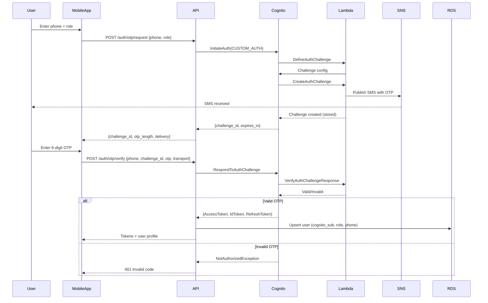

# NetworkPeer End-to-End System Architecture Traceability Matrix
**Version:** 1.3 (Cognito Custom Auth)  
**Date:** 2026-09-02  
**Scope:** iOS, Android, Web, Backend, Infrastructure

---

## Legend
- **UI Element**: User-facing control or screen
- **Client Handler**: Function/method in mobile/web code
- **Protocol**: HTTP method, endpoint, payload structure
- **Backend Service**: Fastify route handler or service
- **Data Layer**: SQL tables, queries, Redis keys
- **Cloud Infra**: AWS services triggered

---

## 1. Authentication & Onboarding

### 1.1 Request OTP (All Platforms)

| Attribute | Detail |
|-----------|--------|
| **UI Element** | "Continue with Phone" button → Phone input → "Send Code" |
| **iOS Handler** | `NetworkPeerAPI.requestOTP(phone: String, role: UserRole)` in `Sources/NetworkPeerCore/NetworkPeerAPI.swift:45` |
| **Android Handler** | `NetworkPeerApi.requestOtp(phoneNumber: String, role: UserRole)` in `app/src/main/java/.../network/NetworkPeerApi.kt:52` |
| **Web Handler** | `requestOTP(phoneNumber, role)` in `src/lib/api.ts:120` |
| **Protocol** | `POST /auth/otp/request` |
| **Request Body** | `{ "phone_number": "+15551234567", "role": "CLIENT" \| "WORKER" }` |
| **Backend Route** | `src/routes/auth.ts:28` → `authService.requestOTP()` |
| **Backend Service** | `src/services/auth-service.ts:45` → `initiateCognitoAuth()` |
| **Cognito Action** | `InitiateAuth(AuthFlow: CUSTOM_AUTH, ClientId, AuthParameters: { USERNAME, ROLE })` |
| **Lambda Trigger** | `DefineAuthChallenge` → Creates challenge, stores in session |
| **Lambda Trigger** | `CreateAuthChallenge` → Generates 6-digit OTP, calls SNS Publish |
| **SNS Action** | `Publish(PhoneNumber, Message: "Your code: 123456")` |
| **Data Layer** | `cognito_custom_auth_challenges` (DynamoDB/In-memory) - challenge_id, otp_hash, expires_at |
| **Response** | `{ "challenge_id": "uuid", "expires_in_seconds": 600, "otp_length": 6, "delivery": { "transport": "sms", "to": "+15551234567" } }` |
| **Cloud Infra** | Cognito User Pool, Lambda (Custom Auth), SNS, CloudWatch Logs |

### 1.2 Verify OTP (All Platforms)

| Attribute | Detail |
|-----------|--------|
| **UI Element** | OTP input fields (6 digits) → "Verify" button |
| **iOS Handler** | `NetworkPeerAPI.verifyOTP(challengeId: String, otp: String, transport: String)` in `NetworkPeerAPI.swift:78` |
| **Android Handler** | `NetworkPeerApi.verifyOtp(challengeId: String, otp: String, transport: String)` in `NetworkPeerApi.kt:85` |
| **Web Handler** | `verifyOTP(challengeId, otp, transport)` in `src/lib/api.ts:155` |
| **Protocol** | `POST /auth/otp/verify` |
| **Request Body** | `{ "phone_number": "+15551234567", "challenge_id": "uuid", "otp": "123456", "transport": "sms" \| "browser" }` |
| **Backend Route** | `src/routes/auth.ts:65` → `authService.verifyOTP()` |
| **Backend Service** | `src/services/auth-service.ts:89` → `respondToCognitoChallenge()` |
| **Cognito Action** | `RespondToAuthChallenge(ChallengeName: CUSTOM_CHALLENGE, ChallengeResponses: { USERNAME, ANSWER, CHALLENGE_ID })` |
| **Lambda Trigger** | `VerifyAuthChallengeResponse` → Validates OTP against stored hash |
| **Success Result** | Cognito returns `AuthenticationResult`: AccessToken, IdToken, RefreshToken |
| **Backend Post-Auth** | `ensureUserRecord()` → Upsert `users` table with `cognito_sub`, role, phone |
| **Data Layer** | `users` table: `id, cognito_sub, phone, role, created_at, updated_at` |
| **Response (Web)** | Cookies: `access_token` (HttpOnly, Secure, SameSite=Lax), `refresh_token` (HttpOnly, Secure, SameSite=Strict) |
| **Response (Mobile)** | JSON: `{ "access_token": "...", "refresh_token": "...", "id_token": "...", "expires_in": 3600, "user": { "id", "role", "phone" } }` |
| **Cloud Infra** | Cognito, Lambda, RDS (PostgreSQL), CloudWatch |

### 1.3 Token Refresh (All Platforms)

| Attribute | Detail |
|-----------|--------|
| **Trigger** | Access token expiry (1hr) or 401 response |
| **iOS Handler** | `AuthSession.refreshIfNeeded()` in `Sources/NetworkPeerCore/AuthSession.swift` |
| **Android Handler** | `NetworkPeerRepository.refreshAccessToken()` in `NetworkPeerRepository.kt` |
| **Web Handler** | Automatic via `fetch` interceptor in `src/lib/api.ts` (credentials: include) |
| **Protocol** | `POST /auth/refresh` (Web: cookie-based) / `POST /auth/token/refresh` (Mobile) |
| **Backend Route** | `src/routes/auth.ts:110` → `authService.refreshTokens()` |
| **Cognito Action** | `InitiateAuth(AuthFlow: REFRESH_TOKEN_AUTH, AuthParameters: { REFRESH_TOKEN })` |
| **Response** | New AccessToken, IdToken (RefreshToken rotated if configured) |
| **Cloud Infra** | Cognito, CloudWatch |

### 1.4 Logout (All Platforms)

| Attribute | Detail |
|-----------|--------|
| **UI Element** | Settings → "Sign Out" |
| **iOS Handler** | `AuthSession.signOut()` → `POST /auth/logout` |
| **Android Handler** | `NetworkPeerRepository.logout()` → `POST /auth/logout` |
| **Web Handler** | `signOut()` in `src/lib/auth-session.ts` → `POST /auth/logout` |
| **Protocol** | `POST /auth/logout` |
| **Request** | Mobile: `{ "refresh_token": "..." }` / Web: Cookies only |
| **Backend Route** | `src/routes/auth.ts:145` → `authService.logout()` |
| **Cognito Action** | `RevokeToken(Token: refresh_token, ClientId)` |
| **Cleanup** | Clear Keychain/Keystore/Cookies, revoke device tokens |
| **Data Layer** | `device_tokens` table: mark revoked |
| **Cloud Infra** | Cognito, RDS, SNS (if device token cleanup) |

---

## 2. Job Marketplace Flow

### 2.1 Create Job (Client)

| Attribute | Detail |
|-----------|--------|
| **UI Element** | "Post Job" → Form (title, description, location, budget, category) → "Publish" |
| **iOS Handler** | `NetworkPeerAPI.createJob(request: CreateJobRequest)` in `NetworkPeerAPI.swift:145` |
| **Android Handler** | `NetworkPeerApi.createJob(request: CreateJobRequest)` in `NetworkPeerApi.kt:156` |
| **Web Handler** | `createJob(payload)` in `src/lib/api.ts:280` |
| **Protocol** | `POST /jobs` |
| **Headers** | `Authorization: Bearer <access_token>` |
| **Request Body** | `{ "title": "Plumbing", "description": "...", "location": { "lat": 37.7, "lng": -122.4 }, "budget_cents": 50000, "category": "PLUMBING", "privacy_level": "PUBLIC" }` |
| **Backend Route** | `src/routes/jobs.ts:15` → `jobService.create()` |
| **Validation** | Zod schema: required fields, budget > 0, valid coordinates |
| **Auth Check** | `requireRole(['CLIENT'])` middleware |
| **Data Layer** | `INSERT INTO jobs (client_id, title, description, location, budget_cents, category, status, privacy_level) VALUES (...)` |
| **Tables** | `jobs`, `job_categories` |
| **Redis** | Invalidate `jobs:list:*` cache |
| **SNS/APNs** | Notify nearby workers (if implemented) |
| **Response** | `{ "job": { "id", "title", "status": "OPEN", "created_at" } }` |
| **Cloud Infra** | API (ECS/Fargate), RDS, ElastiCache, SNS |

### 2.2 List Jobs (Worker/Client)

| Attribute | Detail |
|-----------|--------|
| **UI Element** | Home/Jobs tab → Pull to refresh / infinite scroll |
| **iOS Handler** | `NetworkPeerAPI.listJobs(cursor: String?, filters: JobFilters)` |
| **Android Handler** | `NetworkPeerApi.listJobs(cursor: String?, filters: JobFilters)` |
| **Web Handler** | `listJobs(params)` in `src/lib/api.ts` |
| **Protocol** | `GET /jobs?cursor=&limit=20&category=&status=` |
| **Backend Route** | `src/routes/jobs.ts:55` → `jobService.list()` |
| **Query** | Cursor-based pagination, PostGIS distance filter |
| **Data Layer** | `SELECT * FROM jobs WHERE status='OPEN' AND (privacy='PUBLIC' OR client_id=$1) ORDER BY created_at DESC LIMIT $2` |
| **Cache** | Redis: `jobs:list:<hash(filters)>` TTL 30s |
| **Response** | `{ "items": [...], "next_cursor": "base64", "has_more": true }` |

### 2.3 Accept Job (Worker)

| Attribute | Detail |
|-----------|--------|
| **UI Element** | Job card → "Accept Job" button → Confirmation modal |
| **iOS Handler** | `NetworkPeerAPI.acceptJob(jobId: String)` |
| **Android Handler** | `NetworkPeerApi.acceptJob(jobId: String)` |
| **Web Handler** | `acceptJob(jobId)` |
| **Protocol** | `POST /jobs/{id}/accept` |
| **Backend Route** | `src/routes/jobs.ts:120` → `jobService.accept()` |
| **Auth Check** | `requireRole(['WORKER'])` + job status = OPEN |
| **Transaction** | `BEGIN; UPDATE jobs SET worker_id=$1, status='ASSIGNED', accepted_at=NOW() WHERE id=$2 AND status='OPEN'; COMMIT;` |
| **Data Layer** | `jobs` table: `worker_id`, `status`, `accepted_at` |
| **Notification** | Push to client: "Worker accepted your job" |
| **Response** | `{ "job": { "id", "status": "ASSIGNED", "worker_id" } }` |

### 2.4 Job Status Updates (Real-time)

| Attribute | Detail |
|-----------|--------|
| **Events** | `JOB_STATUS_CHANGED`, `WORKER_ARRIVED`, `WORKER_DEPARTED`, `JOB_COMPLETED` |
| **Transport** | Socket.io (WebSocket) + Push fallback |
| **Backend Hub** | `src/services/realtime-hub.ts` |
| **Redis Pub/Sub** | Channel: `job:{jobId}` |
| **Mobile** | `NetworkPeerRepository.subscribeToJob(jobId)` → Local state update |
| **Web** | `useJobSocket(jobId)` hook → React state |
| **Push Fallback** | APNs (iOS) / FCM (Android) via `background-worker.ts` |

---

## 3. Evidence Capture & Review

### 3.1 Capture Evidence (Worker)

| Attribute | Detail |
|-----------|--------|
| **UI Element** | Job detail → "Add Evidence" → Camera/Gallery → Metadata → "Upload" |
| **iOS Handler** | `EvidenceUploader.upload(evidence: EvidenceCapture)` in `Sources/NetworkPeerCore/EvidenceUploader.swift` |
| **Android Handler** | `EvidenceRepository.uploadEvidence(...)` in `NetworkPeerRepository.kt` |
| **Protocol** | 1. `POST /evidence/reserve` → 2. `PUT {presigned_url}` → 3. `POST /evidence/complete` |
| **Step 1: Reserve** | `POST /evidence/reserve` `{ "job_id": "uuid", "subtask_id": "uuid", "media_type": "IMAGE\|VIDEO", "mime_type": "image/jpeg", "file_size_bytes": 2048576 }` |
| **Backend Reserve** | `evidenceService.reserveUpload()` → Generates S3 presigned POST |
| **S3 Policy** | Bucket: `networkpeer-evidence-{env}`, Key: `evidence/{job_id}/{uuid}.{ext}`, Conditions: content-length, content-type |
| **Step 2: Upload** | Direct PUT to S3 (client → S3) |
| **Step 3: Complete** | `POST /evidence/complete` `{ "reservation_id": "uuid", "s3_key": "...", "captured_at": "ISO8601" }` |
| **Data Layer** | `evidence` table: `id, job_id, subtask_id, media_type, mime_type, file_size_bytes, s3_key, status, captured_at, uploaded_at` |
| **Response** | `{ "evidence": { "id", "status": "UPLOADED", "download": { "url": "...", "expires_at": "..." } } }` |

### 3.2 Review Evidence (Client)

| Attribute | Detail |
|-----------|--------|
| **UI Element** | Job detail → "Review Evidence" → List → Tap → Fullscreen viewer |
| **iOS Handler** | `NetworkPeerAPI.getClientEvidenceReview(jobId: String)` |
| **Android Handler** | `NetworkPeerApi.getClientEvidenceReview(jobId: String)` |
| **Web Handler** | `getClientEvidenceReview(jobId)` |
| **Protocol** | `GET /jobs/{id}/evidence/review` |
| **Backend Route** | `src/routes/client-evidence-review.ts` → `evidenceService.getReviewPackage()` |
| **Auth Check** | Job client only |
| **Data Layer** | `SELECT * FROM evidence WHERE job_id=$1 ORDER BY captured_at` |
| **S3 Action** | Generate presigned GET URLs (15 min TTL) |
| **Response** | `{ "evidence": [{ "id", "media_type", "mime_type", "download": { "url", "expires_at" } }] }` |

---

## 4. Notifications & Device Management

### 4.1 Register Device Token

| Attribute | Detail |
|-----------|--------|
| **iOS Handler** | `NetworkPeerAPI.registerDeviceToken(token: String, platform: "APNS")` |
| **Android Handler** | `NetworkPeerApi.registerDeviceToken(token: String, platform: "FCM")` |
| **Web Handler** | `registerPushSubscription(subscription: PushSubscription)` |
| **Protocol** | `POST /notifications/device-token` |
| **Request** | `{ "token": "device_push_token", "platform": "APNS\|FCM\|WEB" }` |
| **Backend Route** | `src/routes/notification-device.ts` → `deviceTokenService.register()` |
| **Data Layer** | `device_tokens` table: `id, user_id, token, platform, active, created_at` |
| **Deduplication** | Upsert on (user_id, token, platform) |

### 4.2 Send Notification (Background Worker)

| Attribute | Detail |
|-----------|--------|
| **Trigger** | Job events, evidence upload, messages |
| **Worker** | `src/background-worker.ts` → BullMQ queue `notifications` |
| **Processor** | `notificationProcessor.ts` → `pushNotificationService.send()` |
| **APNs** | `apn` provider → JWT auth → `apn.push(notification, deviceToken)` |
| **FCM** | `firebase-admin` → `messaging.send({ token, notification, data })` |
| **Web Push** | `web-push` → VAPID keys → `push.sendNotification(subscription, payload)` |
| **Data Layer** | Read `device_tokens` where `active=true` and `user_id IN (...)` |
| **Tracking** | `notification_deliveries` table: `id, notification_id, device_token_id, status, sent_at, delivered_at` |

---

## 5. Admin & Platform Operations

### 5.1 Admin Dashboard (Web Only)

| Attribute | Detail |
|-----------|--------|
| **UI Element** | `/admin` → Stats, User Management, Job Oversight |
| **Web Handler** | Admin routes in `src/routes/admin.ts` |
| **Auth Check** | `requireRole(['ADMIN'])` → Cognito group membership |
| **Endpoints** | `GET /admin/stats`, `GET /admin/users`, `GET /admin/jobs`, `POST /admin/users/{id}/suspend` |
| **Data Layer** | Aggregated queries across `users`, `jobs`, `evidence`, `payments` |

---

## 6. Data Model Reference

### Core Tables

| Table | Key Columns | Indexes |
|-------|-------------|---------|
| `users` | `id (PK), cognito_sub (UNIQUE), phone, role, created_at` | `cognito_sub`, `phone` |
| `jobs` | `id (PK), client_id (FK), worker_id (FK), title, status, location (GEOGRAPHY), budget_cents, category, privacy_level, created_at` | `client_id`, `worker_id`, `status`, `location (GIST)` |
| `evidence` | `id (PK), job_id (FK), subtask_id, media_type, mime_type, file_size_bytes, s3_key, status, captured_at, uploaded_at` | `job_id`, `status` |
| `device_tokens` | `id (PK), user_id (FK), token, platform, active, created_at` | `user_id`, `token` |
| `notification_deliveries` | `id (PK), notification_id, device_token_id, status, sent_at, delivered_at` | `notification_id` |
| `cognito_identity_mapping` | `id (PK), cognito_sub (UNIQUE), user_id (FK), created_at` | `cognito_sub` |

### Redis Keys

| Pattern | TTL | Purpose |
|---------|-----|---------|
| `jobs:list:{hash}` | 30s | Paginated job lists |
| `job:detail:{id}` | 60s | Single job detail |
| `user:profile:{id}` | 300s | User profile cache |
| `auth:rate_limit:{ip}` | 60s | Auth endpoint rate limiting |

---

## 7. Cloud Infrastructure Mapping

| Component | AWS Service | Config Notes |
|-----------|-------------|--------------|
| **API Hosting** | ECS Fargate | ALB + Target Groups, Auto Scaling |
| **Database** | RDS PostgreSQL 15+ | Multi-AZ, encrypted, automated backups |
| **Cache** | ElastiCache Redis 7 | Cluster mode, in-transit encryption |
| **Auth** | Cognito User Pool | Custom Auth triggers, Lambda triggers |
| **SMS** | SNS | Sandbox → Production access required |
| **Push (iOS)** | APNs via Lambda/ECS | Token-based auth |
| **Push (Android)** | FCM via Lambda/ECS | Service account key |
| **File Storage** | S3 | SSE-S3, presigned URLs, lifecycle rules |
| **Secrets** | Secrets Manager | DB password, JWT keys, API keys |
| **Logging** | CloudWatch Logs | Structured JSON, retention 30d |
| **Metrics** | CloudWatch Metrics | Custom: auth_success, job_created, evidence_uploaded |
| **Alerting** | CloudWatch Alarms | Error rate > 5%, latency p99 > 2s |
| **CDN** | CloudFront | S3 evidence download, API caching |
| **DNS** | Route 53 | Alias records for ALB, CloudFront |
| **CI/CD** | GitHub Actions + Terraform | OIDC to AWS, no static keys |

---

## 8. Sequence Diagram: OTP Login Flow

---

## 9. API Contract Summary

### Auth Endpoints
| Method | Path | Auth | Request | Response |
|--------|------|------|---------|----------|
| POST | `/auth/otp/request` | None | `{phone_number, role}` | `{challenge_id, expires_in_seconds, otp_length, delivery}` |
| POST | `/auth/otp/verify` | None | `{phone_number, challenge_id, otp, transport}` | `{access_token, refresh_token, id_token, user}` (mobile) / Cookies (web) |
| POST | `/auth/refresh` | Cookie | - | New access token (cookie) |
| POST | `/auth/token/refresh` | Bearer | `{refresh_token}` | `{access_token, id_token, refresh_token?}` |
| POST | `/auth/logout` | Bearer/Cookie | `{refresh_token?}` | `{success: true}` |

### Job Endpoints
| Method | Path | Auth | Request | Response |
|--------|------|------|---------|----------|
| POST | `/jobs` | CLIENT | CreateJobRequest | Job |
| GET | `/jobs` | Any | Query params | Paginated<Job> |
| GET | `/jobs/{id}` | Any | - | Job |
| POST | `/jobs/{id}/accept` | WORKER | - | Job |
| POST | `/jobs/{id}/complete` | WORKER/CLIENT | - | Job |
| GET | `/jobs/{id}/evidence/review` | CLIENT (owner) | - | EvidenceReviewPackage |

### Evidence Endpoints
| Method | Path | Auth | Request | Response |
|--------|------|------|---------|----------|
| POST | `/evidence/reserve` | WORKER | ReserveRequest | `{reservation_id, upload: {url, fields}}` |
| POST | `/evidence/complete` | WORKER | CompleteRequest | Evidence |

### Notification Endpoints
| Method | Path | Auth | Request | Response |
|--------|------|------|---------|----------|
| POST | `/notifications/device-token` | Bearer | `{token, platform}` | `{success: true}` |
| DELETE | `/notifications/device-token` | Bearer | `{token}` | `{success: true}` |

---

## 10. Error Code Reference

| Code | HTTP | Context | Client Action |
|------|------|---------|---------------|
| `AUTH_CHALLENGE_EXPIRED` | 401 | OTP challenge expired | Re-request OTP |
| `AUTH_INVALID_OTP` | 401 | Wrong OTP | Retry (max 3) then re-request |
| `AUTH_RATE_LIMITED` | 429 | Too many requests | Exponential backoff |
| `JOB_NOT_FOUND` | 404 | Invalid job ID | Navigate back |
| `JOB_ALREADY_ASSIGNED` | 409 | Race condition | Refresh list |
| `EVIDENCE_TOO_LARGE` | 413 | >25MB | Compress/retry |
| `EVIDENCE_INVALID_TYPE` | 400 | Bad MIME | Validate before upload |
| `FORBIDDEN` | 403 | Role/ownership mismatch | Show error, no retry |
| `SERVER_ERROR` | 500 | Unexpected | Retry with backoff |

---

*This matrix covers the core happy paths for demo. Edge cases and error flows documented in API spec.*